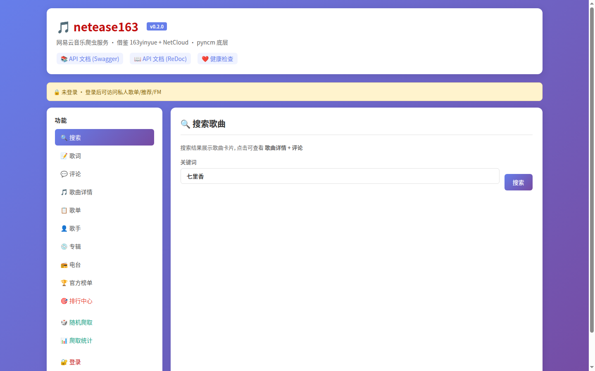
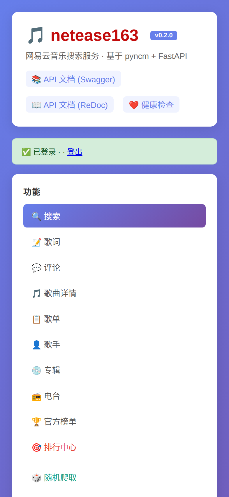

# netease163

网易云音乐爬虫服务。基于 pyncm 库 + FastAPI，提供音乐搜索、歌词获取、评论抓取、AI 评论质量分析、热度排行等功能。

## ✨ 功能

### 🎵 音乐爬取
- 歌曲 / 歌单 / 歌手 / 专辑 / 电台 / 排行榜
- 歌词 / 评论批量抓取
- 随机爬取策略：跟时间做朋友（重爬 7 天前的歌 + 补充新歌 + 评论增量）

### 🤖 AI 评论质量分析
- LLM 批量识别评论质量（0-5 星）
- 自动回写 `ai_score` / `ai_label` / `ai_reason`
- 30 分钟自动调度，每次分析 500 条
- 高质量评论排行榜（按 AI 评分 + 点赞数）

### 📊 热度排行
- 热门歌曲（按评论数 / 点赞数）
- 神评论（按点赞数）
- 24h 趋势（按评论增量）

### 🎨 WebUI
- 单页应用：搜索/歌词/评论/排行榜/我的音乐
- 支持桌面端 + 移动端

## 🛠️ 技术栈

| 模块 | 技术 |
|------|------|
| 后端 | FastAPI + SQLAlchemy 2.0 + pyncm |
| 前端 | 单页 WebUI（HTML + 原生 JS） |
| 数据库 | SQLite |
| LLM | Anthropic 兼容 API |
| 调度 | systemd service + asyncio |

## 🚀 快速开始

### 安装

```bash
# 1. 克隆
git clone https://github.com/d9g/netease163.git
cd netease163

# 2. 创建虚拟环境
python3 -m venv .venv
source .venv/bin/activate
pip install -r requirements.txt

# 3. 配置环境变量
cp .env.example .env
# 编辑 .env: ANTHROPIC_API_KEY=***

# 4. 启动
python -m uvicorn netease163.api.app:app --host 127.0.0.1 --port <PORT>
```

### systemd 部署

```bash
systemctl daemon-reload
systemctl enable --now netease163.service netease163-scheduler.service
```

## 📦 项目结构

```
netease163/
├── netease163/
│   ├── api/            # FastAPI 路由
│   ├── ai/             # LLM 评论质量分析
│   ├── spiders/        # 各模块爬虫
│   ├── random_crawler/ # 跟时间做朋友 爬虫策略
│   ├── storage/        # SQLAlchemy 模型 + DB
│   └── utils/          # 日志/Helper 工具
├── webui/dist/         # 单页 WebUI 静态文件
├── scripts/            # 调度器脚本
├── data/               # SQLite DB + 日志
└── docs/               # 文档 + 截图
```

## 📊 数据模型（9 张表）

- `songs` — 歌曲元数据
- `comments` — 评论（含 AI 评分字段）
- `lyrics` — 歌词
- `playlists` / `playlist_songs` — 歌单
- `artists` / `albums` — 歌手/专辑
- `crawl_priority` — 爬虫优先级队列
- `song_crawl_status` — 单曲爬取状态
- `song_hot_stats` — 每日热度统计
- `keywords` — 关键词池（自扩展）
- `crawl_log` — 爬取日志

## ⚙️ 自动调度

### 评论分析

| 配置项 | 值 |
|--------|-----|
| 间隔 | 30 分钟 |
| 每轮 | 500 评论 |
| 批量 | 25 条/批 |
| 评分 | 0-5 星 (LLM) |

### 爬虫调度

| 配置项 | 值 |
|--------|-----|
| 间隔 | 90 分钟 |
| 每轮目标 | 7 首 |
| 跟时间做朋友分配 | 5 重爬 + 3 新歌 + 2 评论 |

## 📸 截图

### 桌面端

[](docs/screenshots/webui-desktop.png)

### 移动端

[](docs/screenshots/webui-mobile.png)

> 💡 点击图片查看完整大小（GitHub 私有仓库需登录后访问）

## 📝 开发

基于以下开源项目：
- [pyncm](https://github.com/greats3an/pyncm) — 网易云 API 封装库

## 📄 License

仅供学习交流，请勿用于商业用途。